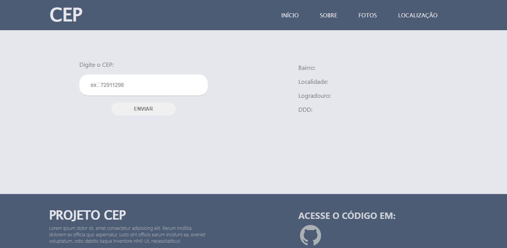

# Buscador de CEP

Projeto feito em react + typescrpt. O usuário digita seu cep e clica em enviar. Logo após, informações como: bairro, ddd, logradouro e localidade serão exibidos.
### Axios
Essa biblioteca foi utilizada para o consumo da API.

### API Utilizada
[ViaCep](https://viacep.com.br/) é um webservice em que deve ser fornecido um cep de 8 digitos e em seguida um retorno desejado.

 ##
  

  

  

  
  

### Instalação
`npm install`

### Para rodar o projeto
`npm run dev`

### [Clique aqui para ver o projeto](https://react-gym-three.vercel.app)